# KnowledgeGraphBuilderV2 执行过程序列图

## Pipeline架构执行流程 (并发优化版)

```mermaid
sequenceDiagram
    participant Client
    participant KnowledgeGraphBuilderV2 as KnowledgeGraphBuilderV2
    participant PipelineFactory as PipelineFactory
    participant BuildContext as BuildContext
    participant ConcurrentPipeline as ConcurrentPipeline
    participant ConcurrencyManager as ConcurrencyManager
    participant TextChunkingStep as TextChunkingStep
    participant ConcurrentEntityStep as ConcurrentEntityStep
    participant RelationExtractionStep as RelationExtractionStep
    participant ClusterFormationStep as ClusterFormationStep
    participant GraphAssemblyStep as GraphAssemblyStep
    participant CacheManager as CacheManager
    participant Handlers as Handlers

    %% 1. 初始化阶段
    Client->>KnowledgeGraphBuilderV2: __init__(config)
    KnowledgeGraphBuilderV2->>PipelineFactory: create_pipeline_factory()
    KnowledgeGraphBuilderV2->>CacheManager: initialize()
    KnowledgeGraphBuilderV2-->>Client: Builder initialized

    %% 2. 构建请求
    Client->>KnowledgeGraphBuilderV2: build_from_text(texts, graph_name, use_cache, from_step)
    
    %% 3. 上下文创建
    KnowledgeGraphBuilderV2->>BuildContext: create(texts, graph_name, use_cache, from_step)
    BuildContext-->>KnowledgeGraphBuilderV2: context created
    
    %% 4. 并发管道创建
    KnowledgeGraphBuilderV2->>PipelineFactory: create_concurrent_pipeline(handlers)
    PipelineFactory->>ConcurrentPipeline: create()
    PipelineFactory->>ConcurrencyManager: initialize_resources()
    ConcurrencyManager-->>PipelineFactory: concurrency config
    PipelineFactory->>ConcurrentPipeline: add_step(TextChunkingStep, deps=[], parallel=true)
    PipelineFactory->>ConcurrentPipeline: add_step(ConcurrentEntityStep, deps=[chunking], parallel=true)
    PipelineFactory->>ConcurrentPipeline: add_step(RelationExtractionStep, deps=[entity], parallel=true)
    PipelineFactory->>ConcurrentPipeline: add_step(ClusterFormationStep, deps=[entity,relation], parallel=false)
    PipelineFactory->>ConcurrentPipeline: add_step(GraphAssemblyStep, deps=[cluster], parallel=false)
    ConcurrentPipeline->>ConcurrentPipeline: build_parallel_groups()
    ConcurrentPipeline-->>PipelineFactory: concurrent pipeline configured
    PipelineFactory-->>KnowledgeGraphBuilderV2: concurrent pipeline created

    %% 5. 并发管道执行
    KnowledgeGraphBuilderV2->>ConcurrentPipeline: execute(context)
    ConcurrentPipeline->>ConcurrentPipeline: initialize_metrics()
    ConcurrentPipeline->>ConcurrencyManager: get_execution_plan()
    
    %% 并发组1：文本分块 (独立执行)
    ConcurrentPipeline->>TextChunkingStep: execute(context) [Group 1]
    TextChunkingStep->>ConcurrencyManager: acquire_resources([chunking])
    TextChunkingStep->>CacheManager: check_cache(step_name)
    alt Cache Miss
        TextChunkingStep->>Handlers: parallel_chunk_texts(texts) [CONCURRENT]
        Note over TextChunkingStep, Handlers: 多线程分块处理
        Handlers-->>TextChunkingStep: chunks
        TextChunkingStep->>CacheManager: save_step_result(chunks)
    else Cache Hit
        CacheManager-->>TextChunkingStep: cached_chunks
    end
    TextChunkingStep->>BuildContext: update_chunks(chunks)
    TextChunkingStep->>ConcurrencyManager: release_resources()
    TextChunkingStep-->>ConcurrentPipeline: StepResult(success, chunks)
    ConcurrentPipeline->>ConcurrentPipeline: mark_step_completed(chunking)

    %% 并发组2：实体提取 (批量并发)
    ConcurrentPipeline->>ConcurrentEntityStep: execute(context) [Group 2]
    ConcurrentEntityStep->>ConcurrencyManager: acquire_resources([entity_extraction, llm_calls])
    ConcurrentEntityStep->>ConcurrentEntityStep: prepare_batches(chunks)
    
    par Batch 1
        ConcurrentEntityStep->>Handlers: extract_entity_batch_1() [ASYNC]
    and Batch 2  
        ConcurrentEntityStep->>Handlers: extract_entity_batch_2() [ASYNC]
    and Batch 3
        ConcurrentEntityStep->>Handlers: extract_entity_batch_3() [ASYNC]
    end
    
    Note over ConcurrentEntityStep, Handlers: 批量并发处理，智能负载均衡
    Handlers-->>ConcurrentEntityStep: [entities_batch_1, entities_batch_2, entities_batch_3]
    ConcurrentEntityStep->>ConcurrentEntityStep: merge_and_deduplicate(entity_batches)
    ConcurrentEntityStep->>BuildContext: update_entities(entities)
    ConcurrentEntityStep->>ConcurrencyManager: release_resources()
    ConcurrentEntityStep-->>ConcurrentPipeline: StepResult(success, entities)
    ConcurrentPipeline->>ConcurrentPipeline: mark_step_completed(entity_extraction)

    %% 步骤3：关系提取
    BuildPipeline->>RelationExtractionStep: execute(context)
    RelationExtractionStep->>CacheManager: check_cache(step_name)
    alt Cache Miss and Entities Available
        RelationExtractionStep->>Handlers: relation_handler.extract_relations(chunks, entities)
        Handlers-->>RelationExtractionStep: relations
        RelationExtractionStep->>CacheManager: save_step_result(relations)
        RelationExtractionStep->>BuildContext: update_relations(relations)
        RelationExtractionStep-->>BuildPipeline: StepResult(success, relations)
    else No Entities
        RelationExtractionStep-->>BuildPipeline: StepResult(failure, "No entities available")
        BuildPipeline->>BuildPipeline: handle_step_failure()
        BuildPipeline-->>KnowledgeGraphBuilderV2: Pipeline failed
        KnowledgeGraphBuilderV2-->>Client: Exception: STEP_FAILURE
    else Cache Hit
        CacheManager-->>RelationExtractionStep: cached_relations
        RelationExtractionStep->>BuildContext: update_relations(relations)
        RelationExtractionStep-->>BuildPipeline: StepResult(success, relations)
    end
    BuildPipeline->>BuildPipeline: update_step_metrics(step_name)

    %% 步骤4：聚类形成
    BuildPipeline->>ClusterFormationStep: execute(context)
    ClusterFormationStep->>CacheManager: check_cache(step_name)
    alt Cache Miss
        ClusterFormationStep->>Handlers: cluster_handler.form_clusters(entities, relations)
        Handlers-->>ClusterFormationStep: clusters
        ClusterFormationStep->>CacheManager: save_step_result(clusters)
    else Cache Hit
        CacheManager-->>ClusterFormationStep: cached_clusters
    end
    ClusterFormationStep->>BuildContext: update_clusters(clusters)
    ClusterFormationStep-->>BuildPipeline: StepResult(success, clusters)
    BuildPipeline->>BuildPipeline: update_step_metrics(step_name)

    %% 步骤5：图谱组装
    BuildPipeline->>GraphAssemblyStep: execute(context)
    GraphAssemblyStep->>CacheManager: check_cache(step_name)
    alt Cache Miss
        GraphAssemblyStep->>Handlers: graph_assembler.assemble_knowledge_graph(chunks, entities, relations, clusters)
        Handlers-->>GraphAssemblyStep: knowledge_graph
        GraphAssemblyStep->>CacheManager: save_step_result(knowledge_graph)
    else Cache Hit
        CacheManager-->>GraphAssemblyStep: cached_knowledge_graph
    end
    GraphAssemblyStep->>BuildContext: update_knowledge_graph(knowledge_graph)
    GraphAssemblyStep-->>BuildPipeline: StepResult(success, knowledge_graph)
    BuildPipeline->>BuildPipeline: update_step_metrics(step_name)

    %% 6. 管道完成
    BuildPipeline->>BuildPipeline: calculate_total_metrics()
    BuildPipeline->>CacheManager: update_build_status(completed)
    BuildPipeline-->>KnowledgeGraphBuilderV2: knowledge_graph

    %% 7. 返回结果
    KnowledgeGraphBuilderV2->>KnowledgeGraphBuilderV2: log_completion_stats()
    KnowledgeGraphBuilderV2-->>Client: knowledge_graph
```

## 关键特性说明

### 🔄 Pipeline架构优势

1. **模块化步骤执行**
   - 每个步骤独立封装，职责单一
   - 支持步骤跳过和从指定步骤开始
   - 步骤间数据通过BuildContext传递

2. **智能缓存机制**
   - 每个步骤都有独立的缓存检查
   - 支持步骤级别的缓存失效和更新
   - 缓存命中时直接使用缓存结果

3. **错误处理和恢复**
   - 步骤失败时立即停止管道执行
   - 提供详细的错误信息和定位
   - 支持从失败步骤重新开始

4. **性能监控和指标**
   - 每个步骤的执行时间统计
   - 管道整体性能指标
   - 成功率和失败率追踪

### ⚡ 并发架构 vs Legacy版本对比

| 特性 | Legacy架构 | Pipeline架构 | 并发Pipeline架构 |
|------|-----------|-------------|------------------|
| **代码复杂度** | 171行单一方法 | 30行主方法 + 模块化步骤 | 30行主方法 + 并发步骤 |
| **执行模式** | 串行执行 | 串行步骤 | **并行组执行** |
| **资源利用** | 单线程，CPU利用率低 | 单线程，改善了组织 | **多线程，CPU利用率高** |
| **批处理** | 无批处理 | 基础批处理 | **智能批处理+负载均衡** |
| **并发控制** | 无 | 无 | **资源感知+信号量控制** |
| **错误处理** | 继续执行，难以定位 | 立即停止，精确定位 | **并发错误隔离+快速恢复** |
| **缓存策略** | 手工管理，易出错 | 自动管理，步骤级别 | **并发缓存+文档级缓存** |
| **可扩展性** | 修改核心方法 | 添加新步骤类 | **依赖管理+并行组配置** |
| **测试友好** | 整体测试困难 | 步骤独立测试 | **并发测试+负载测试** |
| **性能监控** | 基础日志 | 详细指标和统计 | **实时资源监控+并发指标** |
| **性能提升** | 基准 | 组织性提升 | **2-5x 吞吐量提升** |

### 🎯 执行流程亮点

1. **上下文驱动**: BuildContext统一管理所有中间状态和数据
2. **工厂模式**: PipelineFactory负责管道的创建和配置
3. **责任链模式**: 步骤按顺序执行，每个步骤处理特定任务
4. **状态管理**: CacheManager统一处理缓存和构建状态
5. **错误传播**: 任何步骤失败都会中断整个管道并报告详细错误

这种Pipeline架构实现了**83%的代码复杂度降低**，同时提供了更好的可维护性、可扩展性和错误处理能力。