# AGraph build_from_text 序列图

## Mermaid 序列图

```mermaid
sequenceDiagram
    participant Client
    participant KnowledgeGraphBuilder as KGBuilder
    participant CacheManager
    participant TextChunkerHandler
    participant EntityHandler
    participant RelationHandler
    participant ClusterHandler
    participant GraphAssembler
    participant Logger

    Note over Client, Logger: AGraph build_from_text 流程

    %% 初始化阶段
    Client->>+KGBuilder: build_from_text(texts, graph_name, graph_description, use_cache, from_step)
    KGBuilder->>Logger: info("Starting knowledge graph build...")
    
    %% 步骤验证和缓存重置
    KGBuilder->>KGBuilder: 调整 actual_from_step (跳过文档处理)
    
    alt from_step is None (新构建)
        KGBuilder->>CacheManager: reset_build_status()
        CacheManager-->>KGBuilder: 状态重置完成
        KGBuilder->>CacheManager: update_build_status(completed_step=DOCUMENT_PROCESSING)
        CacheManager-->>KGBuilder: 更新完成
    end

    %% 步骤2: 文本分块
    KGBuilder->>KGBuilder: _should_execute_step(TEXT_CHUNKING, actual_from_step)
    
    alt 需要执行文本分块
        KGBuilder->>Logger: info("Step 2: Chunking texts")
        KGBuilder->>CacheManager: update_build_status(current_step=TEXT_CHUNKING)
        CacheManager-->>KGBuilder: 状态更新
        KGBuilder->>+TextChunkerHandler: chunk_texts(texts, use_cache)
        TextChunkerHandler-->>-KGBuilder: chunks[]
        KGBuilder->>Logger: info("Text chunking completed")
        KGBuilder->>CacheManager: update_build_status(completed_step=TEXT_CHUNKING)
    else 使用缓存结果
        KGBuilder->>Logger: info("Using cached text chunking results")
        KGBuilder->>CacheManager: _get_cached_step_result(TEXT_CHUNKING, texts, list)
        CacheManager-->>KGBuilder: cached chunks[]
    end

    %% 检查是否启用知识图谱
    alt enable_knowledge_graph = True
        
        %% 步骤3: 实体提取
        KGBuilder->>KGBuilder: _should_execute_step(ENTITY_EXTRACTION, actual_from_step)
        
        alt 需要执行实体提取
            KGBuilder->>Logger: info("Step 3: Extracting entities")
            KGBuilder->>CacheManager: update_build_status(current_step=ENTITY_EXTRACTION)
            CacheManager-->>KGBuilder: 状态更新
            KGBuilder->>+EntityHandler: extract_entities_from_chunks(chunks, use_cache)
            Note over EntityHandler: 异步 LLM 调用提取实体
            EntityHandler-->>-KGBuilder: entities[]
            KGBuilder->>Logger: info("Entity extraction completed")
            KGBuilder->>CacheManager: update_build_status(completed_step=ENTITY_EXTRACTION)
        else 使用缓存结果
            KGBuilder->>Logger: info("Using cached entity extraction results")
            KGBuilder->>CacheManager: _get_cached_step_result(ENTITY_EXTRACTION, chunks, list)
            CacheManager-->>KGBuilder: cached entities[]
        end

        %% 步骤4: 关系提取
        KGBuilder->>KGBuilder: _should_execute_step(RELATION_EXTRACTION, actual_from_step)
        
        alt 需要执行关系提取
            KGBuilder->>Logger: info("Step 4: Extracting relations")
            KGBuilder->>CacheManager: update_build_status(current_step=RELATION_EXTRACTION)
            CacheManager-->>KGBuilder: 状态更新
            KGBuilder->>+RelationHandler: extract_relations_from_chunks(chunks, entities, use_cache)
            Note over RelationHandler: 异步 LLM 调用提取关系
            RelationHandler-->>-KGBuilder: relations[]
            KGBuilder->>Logger: info("Relation extraction completed")
            KGBuilder->>CacheManager: update_build_status(completed_step=RELATION_EXTRACTION)
        else 使用缓存结果
            KGBuilder->>Logger: info("Using cached relation extraction results")
            KGBuilder->>CacheManager: _get_cached_step_result(RELATION_EXTRACTION, (chunks,entities), list)
            CacheManager-->>KGBuilder: cached relations[]
        end

        %% 步骤5: 聚类形成
        KGBuilder->>KGBuilder: _should_execute_step(CLUSTER_FORMATION, actual_from_step)
        
        alt 需要执行聚类
            KGBuilder->>Logger: info("Step 5: Forming clusters")
            KGBuilder->>CacheManager: update_build_status(current_step=CLUSTER_FORMATION)
            CacheManager-->>KGBuilder: 状态更新
            KGBuilder->>+ClusterHandler: form_clusters(entities, relations, use_cache)
            Note over ClusterHandler: 聚类算法处理
            ClusterHandler-->>-KGBuilder: clusters[]
            KGBuilder->>Logger: info("Cluster formation completed")
            KGBuilder->>CacheManager: update_build_status(completed_step=CLUSTER_FORMATION)
        else 使用缓存结果
            KGBuilder->>Logger: info("Using cached cluster formation results")
            KGBuilder->>CacheManager: _get_cached_step_result(CLUSTER_FORMATION, (entities,relations), list)
            CacheManager-->>KGBuilder: cached clusters[]
        end

    else knowledge_graph disabled
        Note over KGBuilder: 跳过实体提取、关系提取、聚类形成
        KGBuilder->>Logger: info("Skipping entity/relation/cluster extraction")
        Note over KGBuilder: entities = [], relations = [], clusters = []
    end

    %% 步骤6: 知识图谱组装
    KGBuilder->>KGBuilder: _should_execute_step(GRAPH_ASSEMBLY, actual_from_step)
    
    alt 需要执行图谱组装
        KGBuilder->>Logger: info("Step 6: Assembling knowledge graph")
        KGBuilder->>CacheManager: update_build_status(current_step=GRAPH_ASSEMBLY)
        CacheManager-->>KGBuilder: 状态更新
        KGBuilder->>+GraphAssembler: assemble_knowledge_graph(entities, relations, clusters, chunks, graph_name, graph_description, use_cache)
        Note over GraphAssembler: 使用统一管理器架构组装知识图谱
        GraphAssembler-->>-KGBuilder: OptimizedKnowledgeGraph
        KGBuilder->>Logger: info("Knowledge graph assembly completed")
        KGBuilder->>CacheManager: update_build_status(completed_step=GRAPH_ASSEMBLY)
    else 使用缓存结果
        KGBuilder->>Logger: info("Using cached knowledge graph assembly results")
        KGBuilder->>CacheManager: _get_cached_step_result(GRAPH_ASSEMBLY, (...), OptimizedKnowledgeGraph)
        CacheManager-->>KGBuilder: cached kg
        
        alt cached_kg is None
            KGBuilder->>Logger: warning("Cached knowledge graph not found, assembling new graph")
            KGBuilder->>+GraphAssembler: assemble_knowledge_graph(...)
            GraphAssembler-->>-KGBuilder: OptimizedKnowledgeGraph
        end
    end

    %% 完成
    KGBuilder->>Logger: info("Knowledge graph build completed successfully")
    KGBuilder-->>-Client: OptimizedKnowledgeGraph

    %% 异常处理
    Note over KGBuilder, Logger: 异常处理机制
    alt Exception occurs
        KGBuilder->>Logger: error("Knowledge graph build failed")
        KGBuilder->>CacheManager: update_build_status(error_message)
        KGBuilder-->>Client: raise Exception
    end
```

## 主要组件说明

### 核心参与者
- **Client**: 调用方
- **KnowledgeGraphBuilder**: 主要构建器，协调整个流程
- **CacheManager**: 缓存管理器，负责状态管理和缓存操作
- **TextChunkerHandler**: 文本分块处理器
- **EntityHandler**: 实体提取处理器(异步LLM调用)
- **RelationHandler**: 关系提取处理器(异步LLM调用)
- **ClusterHandler**: 聚类处理器
- **GraphAssembler**: 知识图谱组装器

### 处理流程

#### 1. 初始化阶段
- 调整执行步骤(跳过文档处理步骤)
- 如果是新构建，重置缓存状态并标记文档处理已完成

#### 2. 主要处理步骤
每个步骤都遵循相同的模式:
- 检查是否需要执行该步骤
- 更新构建状态为"进行中"
- 执行处理或从缓存获取结果  
- 更新构建状态为"已完成"

**步骤顺序:**
1. ~~文档处理~~ (跳过)
2. **文本分块**: 将输入文本切分为处理块
3. **实体提取**: 使用LLM异步提取实体(如果启用知识图谱)
4. **关系提取**: 使用LLM异步提取实体间关系(如果启用知识图谱)
5. **聚类形成**: 对实体和关系进行聚类分析(如果启用知识图谱)
6. **图谱组装**: 使用统一架构管理器组装最终知识图谱

#### 3. 缓存策略
- 每个步骤都支持缓存机制
- 可以从指定步骤开始继续构建
- 缓存失效时会自动回退到重新处理

#### 4. 条件执行
- `enable_knowledge_graph=False` 时跳过实体、关系、聚类步骤
- 支持从指定步骤恢复构建(`from_step`参数)

#### 5. 异常处理
- 统一的异常捕获和日志记录
- 构建状态中记录错误信息

### 技术特点

1. **异步支持**: 实体和关系提取支持异步LLM调用
2. **缓存优化**: 多级缓存支持，提升重复构建效率
3. **步骤控制**: 灵活的步骤控制和恢复机制
4. **状态管理**: 完整的构建状态跟踪
5. **模块化设计**: 每个处理步骤都有独立的处理器
6. **统一架构**: 使用OptimizedKnowledgeGraph和统一管理器架构

### 性能考虑

- **并发处理**: 实体和关系提取使用异步处理，支持批量并发
- **缓存策略**: 智能缓存避免重复计算
- **增量构建**: 支持从中间步骤继续构建
- **资源管理**: 支持异步上下文管理器(`async with`)

这个序列图展示了AGraph知识图谱构建的完整流程，突出了其模块化架构、缓存优化和异步处理能力。