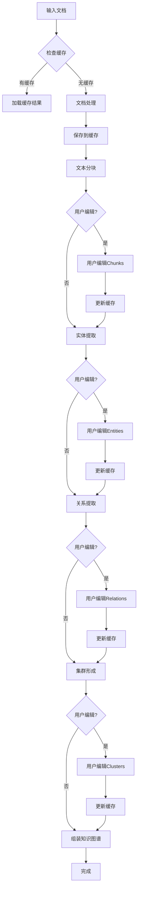

# KnowledgeGraph Builder 设计文档

## 概述

KnowledgeGraph Builder 是一个用于从文档构建知识图谱的核心类，它集成了文档处理、文本分块、实体提取、关系识别和集群形成等功能。该构建器支持分步骤缓存和用户交互编辑，允许在任意步骤暂停、修改结果并从修改点继续处理。

## 架构设计

### 核心组件

```python
class KnowledgeGraphBuilder:
    """
    知识图谱构建器，负责从文档到知识图谱的完整构建流程

    核心特性：
    - 分步骤处理和缓存
    - 用户交互式编辑
    - 断点续传功能
    - 增量更新支持

    工作流程：
    1. 文档处理 (Document Processing) - 使用 agraph.processor [可缓存]
    2. 文本分块 (Text Chunking) - 使用 agraph.chunker [可缓存, 可编辑]
    3. 实体提取 (Entity Extraction) - 从分块中识别实体 [可缓存, 可编辑]
    4. 关系识别 (Relation Extraction) - 识别实体间关系 [可缓存, 可编辑]
    5. 集群形成 (Cluster Formation) - 根据关系组织实体 [可缓存, 可编辑]
    6. 知识图谱构建 (Graph Assembly) - 组装最终的知识图谱 [可缓存]
    """
```

### 主要功能模块

#### 1. 文档处理模块 (Document Processing)

- **功能**: 处理各种格式的文档（PDF、HTML、Word、JSON等）
- **依赖**: `agraph.processor.*` 模块
- **输出**: 结构化文本内容
- **缓存**: 原始文档内容和处理结果

#### 2. 文本分块模块 (Text Chunking)

- **功能**: 将长文档分割成可管理的文本块
- **依赖**: `agraph.chunker.TokenChunker`
- **输出**: TextChunk 对象列表
- **缓存**: 分块结果和分块参数
- **用户交互**: 支持手动调整分块边界、合并/分割chunks

#### 3. 实体提取模块 (Entity Extraction)

- **功能**: 从文本块中识别和提取实体
- **方法**: NLP模型 + 规则匹配
- **输出**: Entity 对象列表
- **缓存**: 提取的实体和置信度
- **用户交互**: 添加/删除/修改实体，调整实体类型和属性

#### 4. 关系识别模块 (Relation Extraction)

- **功能**: 识别实体间的语义关系
- **方法**: 关系分类模型 + 模式匹配
- **输出**: Relation 对象列表
- **缓存**: 识别的关系和置信度
- **用户交互**: 添加/删除/修改关系，调整关系类型和强度

#### 5. 集群形成模块 (Cluster Formation)

- **功能**: 根据实体关系形成语义集群
- **算法**: 图聚类算法（如社区发现）
- **输出**: Cluster 对象列表
- **缓存**: 集群结果和算法参数
- **用户交互**: 手动调整集群成员，合并/分割集群

## API 设计

### 核心接口

```python
class KnowledgeGraphBuilder:
    def __init__(
        self,
        cache_dir: Optional[Union[str, Path]] = None,
        chunker: Optional[TokenChunker] = None,
        entity_extractor: Optional[EntityExtractor] = None,
        relation_extractor: Optional[RelationExtractor] = None,
        cluster_algorithm: Optional[ClusterAlgorithm] = None,
        llm_config: Optional[Dict] = None
    ):
        """初始化构建器，允许自定义各个组件和缓存目录"""

    # 主要构建方法
    def build_from_documents(
        self,
        documents: List[Union[str, Path]],
        graph_name: str = "",
        graph_description: str = "",
        use_cache: bool = True,
        from_step: Optional[str] = None
    ) -> KnowledgeGraph:
        """从文档列表构建知识图谱，支持缓存和断点续传"""

    def build_from_text(
        self,
        texts: List[str],
        graph_name: str = "",
        graph_description: str = "",
        use_cache: bool = True,
        from_step: Optional[str] = None
    ) -> KnowledgeGraph:
        """从文本列表构建知识图谱，支持缓存和断点续传"""

    # 分步处理方法
    def process_documents(
        self,
        documents: List[Union[str, Path]],
        use_cache: bool = True
    ) -> List[str]:
        """处理文档，返回文本内容"""

    def chunk_texts(
        self,
        texts: List[str],
        use_cache: bool = True
    ) -> List[TextChunk]:
        """分割文本为chunks"""

    def extract_entities_from_chunks(
        self,
        chunks: List[TextChunk],
        use_cache: bool = True
    ) -> List[Entity]:
        """从文本块提取实体"""

    def extract_relations_from_chunks(
        self,
        chunks: List[TextChunk],
        entities: List[Entity],
        use_cache: bool = True
    ) -> List[Relation]:
        """从文本块提取关系"""

    def form_clusters(
        self,
        entities: List[Entity],
        relations: List[Relation],
        use_cache: bool = True
    ) -> List[Cluster]:
        """根据实体和关系形成集群"""

    # 缓存管理方法
    def save_step_result(
        self,
        step_name: str,
        result: Any,
        metadata: Optional[Dict] = None
    ) -> None:
        """保存步骤结果到缓存"""

    def load_step_result(
        self,
        step_name: str,
        expected_type: Type
    ) -> Optional[Any]:
        """从缓存加载步骤结果"""

    def has_cached_step(self, step_name: str) -> bool:
        """检查是否有缓存的步骤结果"""

    def clear_cache(self, from_step: Optional[str] = None) -> None:
        """清除缓存，可指定从某步骤开始清除"""

    # 用户交互方法
    def get_chunks_for_editing(self) -> List[TextChunk]:
        """获取可编辑的文本块"""

    def update_chunks(self, chunks: List[TextChunk]) -> None:
        """更新文本块并清除后续步骤的缓存"""

    def get_entities_for_editing(self) -> List[Entity]:
        """获取可编辑的实体列表"""

    def update_entities(self, entities: List[Entity]) -> None:
        """更新实体并清除后续步骤的缓存"""

    def get_relations_for_editing(self) -> List[Relation]:
        """获取可编辑的关系列表"""

    def update_relations(self, relations: List[Relation]) -> None:
        """更新关系并清除后续步骤的缓存"""

    def get_clusters_for_editing(self) -> List[Cluster]:
        """获取可编辑的集群列表"""

    def update_clusters(self, clusters: List[Cluster]) -> None:
        """更新集群并清除后续步骤的缓存"""

    # 状态查询方法
    def get_build_status(self) -> Dict[str, Any]:
        """获取构建状态和进度"""

    def get_cache_info(self) -> Dict[str, Any]:
        """获取缓存信息"""
```

### 配置选项

```python
@dataclass
class BuilderConfig:
    """构建器配置"""

    # 缓存配置
    enable_cache: bool = True
    cache_dir: str = "./cache"
    cache_ttl: int = 86400  # 缓存存活时间（秒）
    auto_cleanup: bool = True

    # 分块配置
    chunk_size: int = 1000
    chunk_overlap: int = 200

    # 实体提取配置
    entity_confidence_threshold: float = 0.7
    entity_types: List[EntityType] = field(default_factory=list)

    # 关系提取配置
    relation_confidence_threshold: float = 0.6
    relation_types: List[RelationType] = field(default_factory=list)

    # 集群配置
    cluster_algorithm: str = "community_detection"
    min_cluster_size: int = 2

    # LLM配置
    llm_provider: str = "openai"
    llm_model: str = "gpt-3.5-turbo"

    # 交互配置
    enable_user_interaction: bool = True
    auto_save_edits: bool = True

@dataclass
class CacheMetadata:
    """缓存元数据"""
    step_name: str
    timestamp: datetime
    input_hash: str
    config_hash: str
    version: str = "1.0"
```

## 工作流程

### 缓存和交互式工作流程



### 步骤详细流程

#### 1. 文档处理 (Document Processing)

```text
Document → [Cache Check] → Processor → Raw Text → [Cache Save]
```

- **缓存键**: 文档路径/内容哈希
- **缓存内容**: 处理后的文本内容

#### 2. 文本分块 (Text Chunking)

```text
Raw Text → [Cache Check] → Chunker → TextChunk[] → [Cache Save] → [User Edit?]
```

- **缓存键**: 文本哈希 + 分块配置哈希
- **缓存内容**: TextChunk对象列表
- **用户交互**: 调整分块边界、合并/分割chunks

#### 3. 实体提取 (Entity Extraction)

```text
TextChunk[] → [Cache Check] → EntityExtractor → Entity[] → [Cache Save] → [User Edit?]
```

- **缓存键**: Chunks哈希 + 提取器配置哈希
- **缓存内容**: Entity对象列表 + 置信度
- **用户交互**: 添加/删除/修改实体

#### 4. 关系提取 (Relation Extraction)

```text
TextChunk[] + Entity[] → [Cache Check] → RelationExtractor → Relation[] → [Cache Save] → [User Edit?]
```

- **缓存键**: Chunks哈希 + Entities哈希 + 提取器配置哈希
- **缓存内容**: Relation对象列表 + 置信度
- **用户交互**: 添加/删除/修改关系

#### 5. 集群形成 (Cluster Formation)

```text
Entity[] + Relation[] → [Cache Check] → ClusterAlgorithm → Cluster[] → [Cache Save] → [User Edit?]
```

- **缓存键**: Entities哈希 + Relations哈希 + 算法配置哈希
- **缓存内容**: Cluster对象列表
- **用户交互**: 调整集群成员

#### 6. 知识图谱组装 (Graph Assembly)

```text
Entity[] + Relation[] + Cluster[] + TextChunk[] → KnowledgeGraph → [Cache Save]
```

- **缓存键**: 所有组件哈希
- **缓存内容**: 完整的KnowledgeGraph对象

## 扩展点

### 1. 自定义处理器

- 支持注册新的文档格式处理器
- 可插拔的处理器架构

### 2. 自定义提取器

- 可替换实体提取算法
- 可替换关系提取算法

### 3. 自定义集群算法

- 支持多种图聚类算法
- 可配置集群参数

## 性能考虑

### 1. 并行处理

- 文档处理并行化
- 实体/关系提取批量处理

### 2. 内存管理

- 大文档流式处理
- 增量构建支持

### 3. 缓存机制

- 分步骤结果缓存
- 模型推理缓存
- 智能缓存失效策略
- 缓存版本管理

## 依赖关系

### 现有组件集成

1. **KnowledgeGraph** (`agraph.base.graph`)
   - 核心数据结构，包含实体、关系、集群和文本块
   - 提供图谱管理和分析功能

2. **文档处理器** (`agraph.processor`)
   - `PDFProcessor` - PDF文档处理
   - `HTMLProcessor` - HTML文档处理
   - `WordProcessor` - Word文档处理
   - `JSONProcessor` - JSON数据处理
   - `TextProcessor` - 纯文本处理

3. **文本分块器** (`agraph.chunker`)
   - `TokenChunker` - 基于token的智能分块
   - `SimpleTokenChunker` - 简化版分块器

4. **核心数据模型** (`agraph.base`)
   - `Entity` - 实体数据模型
   - `Relation` - 关系数据模型
   - `Cluster` - 集群数据模型
   - `TextChunk` - 文本块数据模型

### 新增组件需求

1. **实体提取器** (待实现)
   - 基于NLP模型的命名实体识别
   - 规则匹配和模式识别
   - 实体链接和消歧

2. **关系提取器** (待实现)
   - 句法分析的关系识别
   - 语义模型的关系分类
   - 共指消解和关系合并

3. **集群算法** (待实现)
   - 社区发现算法
   - 层次聚类算法
   - 图嵌入聚类算法

## 使用示例

### 基本使用

```python
from agraph.builder import KnowledgeGraphBuilder

# 创建构建器
builder = KnowledgeGraphBuilder(cache_dir="./my_cache")

# 从文档构建知识图谱（自动缓存）
kg = builder.build_from_documents(
    documents=["doc1.pdf", "doc2.html", "doc3.txt"],
    graph_name="我的知识图谱",
    graph_description="从多个文档构建的知识图谱",
    use_cache=True
)

# 查看统计信息
stats = kg.get_graph_statistics()
print(f"实体数量: {stats['total_entities']}")
print(f"关系数量: {stats['total_relations']}")
print(f"集群数量: {stats['total_clusters']}")
```

### 分步构建和用户交互

```python
from agraph.builder import KnowledgeGraphBuilder, BuilderConfig

# 创建构建器
builder = KnowledgeGraphBuilder(cache_dir="./interactive_cache")

# 步骤1: 处理文档
texts = builder.process_documents(["doc1.pdf", "doc2.txt"])

# 步骤2: 文本分块
chunks = builder.chunk_texts(texts)

# 用户可以编辑分块结果
edited_chunks = edit_chunks_ui(chunks)  # 假设的UI函数
builder.update_chunks(edited_chunks)

# 步骤3: 实体提取
entities = builder.extract_entities_from_chunks(edited_chunks)

# 用户可以编辑实体
edited_entities = edit_entities_ui(entities)  # 假设的UI函数
builder.update_entities(edited_entities)

# 步骤4: 关系提取
relations = builder.extract_relations_from_chunks(
    edited_chunks,
    edited_entities
)

# 用户可以编辑关系
edited_relations = edit_relations_ui(relations)  # 假设的UI函数
builder.update_relations(edited_relations)

# 步骤5: 集群形成
clusters = builder.form_clusters(edited_entities, edited_relations)

# 用户可以编辑集群
edited_clusters = edit_clusters_ui(clusters)  # 假设的UI函数
builder.update_clusters(edited_clusters)

# 最终构建知识图谱
kg = builder.build_from_documents(
    documents=["doc1.pdf", "doc2.txt"],
    from_step="graph_assembly"  # 从组装步骤开始
)
```

### 断点续传

```python
# 初次构建（中断在实体提取步骤）
builder = KnowledgeGraphBuilder(cache_dir="./resume_cache")

try:
    kg = builder.build_from_documents(["large_doc.pdf"])
except KeyboardInterrupt:
    print("构建中断，已保存缓存")

# 稍后从中断点继续
builder2 = KnowledgeGraphBuilder(cache_dir="./resume_cache")

# 检查构建状态
status = builder2.get_build_status()
print(f"上次完成到: {status['last_completed_step']}")

# 从中断点继续
kg = builder2.build_from_documents(
    documents=["large_doc.pdf"],
    from_step=status['last_completed_step']
)
```

### 缓存管理

```python
# 查看缓存信息
cache_info = builder.get_cache_info()
print(f"缓存大小: {cache_info['total_size']}")
print(f"缓存步骤: {cache_info['cached_steps']}")

# 清除特定步骤后的缓存
builder.clear_cache(from_step="entity_extraction")

# 禁用缓存构建
kg = builder.build_from_documents(
    documents=["doc.pdf"],
    use_cache=False
)
```

## 测试策略

### 单元测试

- 各个组件的独立测试
- 配置参数验证测试
- 错误处理测试
- 缓存机制测试
- 用户交互接口测试

### 集成测试

- 端到端的构建流程测试
- 不同文档格式的处理测试
- 大规模数据的性能测试
- 缓存一致性测试
- 断点续传测试

### 质量评估

- 实体提取准确率评估
- 关系识别准确率评估
- 集群质量评估指标
- 用户编辑效果评估

## 缓存系统设计

### 缓存结构

```text
cache_dir/
├── metadata/
│   ├── build_status.json
│   ├── step_metadata.json
│   └── config_hashes.json
├── steps/
│   ├── document_processing/
│   │   ├── {hash}.json
│   │   └── metadata.json
│   ├── text_chunking/
│   │   ├── {hash}.json
│   │   └── metadata.json
│   ├── entity_extraction/
│   │   ├── {hash}.json
│   │   └── metadata.json
│   ├── relation_extraction/
│   │   ├── {hash}.json
│   │   └── metadata.json
│   ├── cluster_formation/
│   │   ├── {hash}.json
│   │   └── metadata.json
│   └── graph_assembly/
│       ├── {hash}.json
│       └── metadata.json
└── user_edits/
    ├── chunks_edits.json
    ├── entities_edits.json
    ├── relations_edits.json
    └── clusters_edits.json
```

### 缓存策略

1. **输入哈希**: 基于输入数据和配置生成哈希键
2. **依赖跟踪**: 跟踪步骤间的依赖关系
3. **版本管理**: 支持缓存版本升级和兼容性检查
4. **TTL管理**: 自动清理过期缓存
5. **增量更新**: 支持部分数据更新而不重新计算

### 用户交互模式

1. **查看模式**: 只读查看各步骤结果
2. **编辑模式**: 交互式编辑特定步骤结果
3. **批量模式**: 批量导入/导出编辑结果
4. **协作模式**: 多用户协作编辑（未来扩展）

这个增强的设计文档为KnowledgeGraph Builder提供了完整的缓存和用户交互功能规范。
