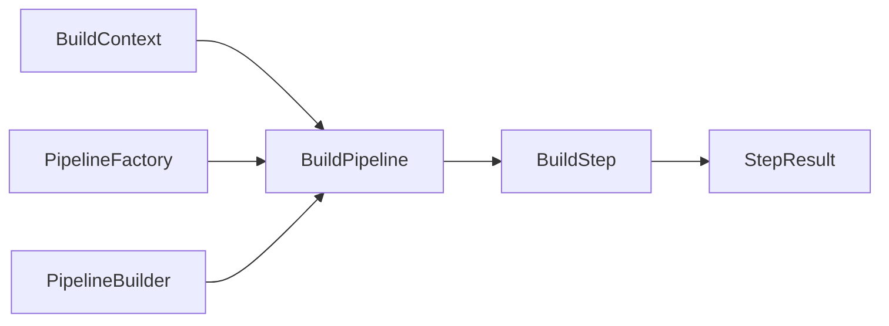

# AGraph 管道定制能力 - 使用教程

## 📋 目录
- [简介](#简介)
- [快速开始](#快速开始)
- [管道架构概述](#管道架构概述)
- [基础管道使用](#基础管道使用)
- [自定义管道创建](#自定义管道创建)
- [高级管道定制](#高级管道定制)
- [性能监控和调试](#性能监控和调试)
- [最佳实践](#最佳实践)
- [故障排除](#故障排除)

---

## 简介

AGraph v0.2.1+ 引入了全新的管道架构，允许用户灵活定制知识图谱构建流程。相比原有的单体方法，新的管道系统提供了：

- ✅ **模块化设计**: 每个步骤独立且可复用
- ✅ **灵活配置**: 支持跳过、替换或添加自定义步骤
- ✅ **性能监控**: 内置的执行指标和错误跟踪
- ✅ **并行就绪**: 为未来的并行执行做好准备
- ✅ **无缝兼容**: 现有代码无需修改即可受益

---

## 快速开始

### 无修改升级 (推荐)

现有用户无需修改任何代码，自动享受新架构的性能提升：

```python
from agraph.builder import KnowledgeGraphBuilder

# 完全相同的API，内部自动使用新管道架构
builder = KnowledgeGraphBuilder()
texts = [\"Apple Inc. is a technology company.\", \"Microsoft was founded by Bill Gates.\"]
kg = await builder.build_from_text(texts, graph_name=\"tech_companies\")
```

### 明确使用新架构

如果您希望明确使用新的管道功能：

```python
from agraph.builder.builder import KnowledgeGraphBuilder

builder = KnowledgeGraphBuilder()
texts = [\"Apple Inc. is a technology company.\", \"Microsoft was founded by Bill Gates.\"]
kg = await builder.build_from_text(texts, graph_name =\"tech_companies\")

# 获取额外的管道指标
metrics = builder.get_pipeline_metrics()
print(f\"构建状态: {metrics}\")
```

---

## 管道架构概述

### 核心组件



#### 关键概念

1. **BuildContext**: 管道执行上下文，存储输入数据、中间结果和状态信息
2. **BuildPipeline**: 管道编排器，按序执行各个步骤
3. **BuildStep**: 抽象步骤类，所有处理步骤的基类
4. **StepResult**: 步骤执行结果，包含数据、错误信息和元数据
5. **PipelineFactory**: 管道工厂，创建预设管道配置
6. **PipelineBuilder**: 管道构建器，使用流式API创建自定义管道

### 标准构建步骤

| 步骤 | 功能 | 输入 | 输出 |
|------|------|------|------|
| **DocumentProcessing** | 文档解析 | 文档路径 | 提取的文本 |
| **TextChunking** | 文本分块 | 文本列表 | 文本块列表 |
| **EntityExtraction** | 实体提取 | 文本块 | 实体列表 |
| **RelationExtraction** | 关系提取 | 文本块+实体 | 关系列表 |
| **ClusterFormation** | 聚类分析 | 实体+关系 | 集群列表 |
| **GraphAssembly** | 图谱组装 | 所有组件 | 知识图谱 |

---

## 基础管道使用

### 1. 预设管道类型

```python
from agraph.builder.builder import KnowledgeGraphBuilder

builder = KnowledgeGraphBuilder()

# 1. 标准管道 (包含文档处理)
documents = [\"document1.pdf\", \"document2.docx\"]
kg = await builder.build_from_documents(documents)

# 2. 文本管道 (跳过文档处理，优化性能)
texts = [\"Direct text input...\"]
kg = await builder.build_from_text(texts)

# 3. 最小管道 (仅文本分块和图谱组装)
minimal_pipeline = builder.create_minimal_pipeline()
# 适用于快速原型或简单文本处理

# 4. 禁用知识图谱功能的管道
builder_simple = KnowledgeGraphBuilder(enable_knowledge_graph = False)
kg = await builder_simple.build_from_text(texts)  # 仅处理文本块
```

### 2. 缓存和恢复控制

```python
# 使用缓存加速重复构建
kg = await builder.build_from_text(
    texts,
    use_cache=True,  # 启用缓存
    graph_name=\"cached_graph\"
)

# 从特定步骤恢复构建 (跳过已完成的步骤)
kg = await builder.build_from_text(
    texts,
    from_step=\"entity_extraction\",  # 从实体提取开始
    graph_name=\"resumed_graph\"
)

# 清理缓存
builder.clear_cache()  # 清理所有缓存
builder.clear_cache(from_step=\"relation_extraction\")  # 清理特定步骤后的缓存
```

---

## 自定义管道创建

### 1. 使用工厂方法

```python
from agraph.builder.builder import KnowledgeGraphBuilder
from agraph.config import BuildSteps

builder = KnowledgeGraphBuilder()

# 创建仅包含特定步骤的管道
custom_config = {
    BuildSteps.TEXT_CHUNKING: builder.text_chunker_handler,
    BuildSteps.ENTITY_EXTRACTION: builder.entity_handler,
    BuildSteps.GRAPH_ASSEMBLY: builder.graph_assembler
}

custom_pipeline = builder.create_custom_pipeline(custom_config)

# 手动执行自定义管道
from agraph.builder.steps.context import BuildContext

context = BuildContext(
    texts = [\"Custom pipeline text processing...\"],
graph_name =\"custom_graph\"
)

kg = await custom_pipeline.execute(context)
```

### 2. 使用Builder模式

```python
# 使用流式API构建管道
custom_pipeline = (builder.pipeline_builder
    .with_text_chunking(builder.text_chunker_handler)
    .with_entity_extraction(builder.entity_handler)
    .with_relation_extraction(builder.relation_handler)
    .with_graph_assembly(builder.graph_assembler)
    .build())

# 执行自定义管道
context = BuildContext(texts=texts, graph_name=\"fluent_graph\")
kg = await custom_pipeline.execute(context)
```

### 3. 条件步骤执行

```python
# 根据数据特征动态决定步骤
def create_adaptive_pipeline(text_length: int) -> BuildPipeline:
    builder_instance = builder.pipeline_builder

    # 总是包含文本分块
    builder_instance.with_text_chunking(builder.text_chunker_handler)

    # 仅对长文本进行实体提取
    if text_length > 1000:
        builder_instance.with_entity_extraction(builder.entity_handler)
        builder_instance.with_relation_extraction(builder.relation_handler)

    # 仅对复杂文档进行聚类
    if text_length > 5000:
        builder_instance.with_cluster_formation(builder.cluster_handler)

    # 总是包含图谱组装
    builder_instance.with_graph_assembly(builder.graph_assembler)

    return builder_instance.build()

# 使用自适应管道
total_length = sum(len(text) for text in texts)
adaptive_pipeline = create_adaptive_pipeline(total_length)
context = BuildContext(texts=texts, graph_name=\"adaptive_graph\")
kg = await adaptive_pipeline.execute(context)
```

---

## 高级管道定制

### 1. 自定义步骤开发

创建自定义处理步骤：

```python
from agraph.builder.steps.base import BuildStep, StepResult
from agraph.builder.steps.context import BuildContext
from typing import List

class CustomTextPreprocessingStep(BuildStep):
    \"\"\"自定义文本预处理步骤\"\"\"

    def __init__(self, cache_manager, preprocessing_config: dict):
        super().__init__(\"custom_preprocessing\", cache_manager)
        self.config = preprocessing_config

    async def _execute_step(self, context: BuildContext) -> StepResult[List[str]]:
        try:
            processed_texts = []
            for text in context.texts:
                # 应用自定义预处理逻辑
                processed_text = self._apply_preprocessing(text)
                processed_texts.append(processed_text)

            return StepResult.success_result(
                processed_texts,
                metadata={
                    \"preprocessing_rules\": len(self.config),
                    \"processed_count\": len(processed_texts)
                }
            )
        except Exception as e:
            return StepResult.failure_result(f\"预处理失败: {str(e)}\")

    def _apply_preprocessing(self, text: str) -> str:
        # 实现您的预处理逻辑
        if self.config.get(\"remove_urls\", False):
            import re
            text = re.sub(r'http[s]?://(?:[a-zA-Z]|[0-9]|[$-_@.&+]|[!*\\(\\),]|(?:%[0-9a-fA-F][0-9a-fA-F]))+', '', text)

        if self.config.get(\"normalize_whitespace\", False):
            text = re.sub(r'\\s+', ' ', text.strip())

        return text

    def _get_cache_input_data(self, context: BuildContext):
        return (context.texts, str(self.config))

    def _get_expected_result_type(self):
        return list

# 使用自定义步骤
preprocessing_config = {\"remove_urls\": True, \"normalize_whitespace\": True}
custom_step = CustomTextPreprocessingStep(builder.cache_manager, preprocessing_config)

# 将自定义步骤插入管道
from agraph.builder.pipeline import BuildPipeline
custom_pipeline = BuildPipeline(builder.cache_manager)
custom_pipeline.add_step(custom_step)  # 添加预处理步骤
custom_pipeline.add_step(TextChunkingStep(builder.text_chunker_handler, builder.cache_manager))
custom_pipeline.add_step(GraphAssemblyStep(builder.graph_assembler, builder.cache_manager))
```

### 2. 并行步骤配置 (实验性)

```python
# 为未来的并行执行准备管道结构
parallel_ready_pipeline = builder.pipeline_factory.create_parallel_pipeline(
    text_chunker_handler=builder.text_chunker_handler,
    entity_handler=builder.entity_handler,
    relation_handler=builder.relation_handler,
    cluster_handler=builder.cluster_handler,
    graph_assembler=builder.graph_assembler
)

# 注意: 当前版本仍为顺序执行，但架构已为并行做好准备
```

### 3. 步骤级别配置

```python
# 为特定步骤配置不同的处理参数
from agraph.builder.handler.entity_handler import EntityHandler
from agraph.builder.extractors import LLMEntityExtractor

# 创建高置信度的实体提取器
high_confidence_extractor = LLMEntityExtractor({
    \"llm_provider\": \"openai\",
    \"llm_model\": \"gpt-4\",
    \"min_confidence\": 0.9  # 提高置信度阈值
})

high_confidence_handler = EntityHandler(builder.cache_manager, high_confidence_extractor)

# 使用定制的处理器创建管道
precision_pipeline = (builder.pipeline_builder
    .with_text_chunking(builder.text_chunker_handler)
    .with_entity_extraction(high_confidence_handler)  # 使用高精度提取器
    .with_graph_assembly(builder.graph_assembler)
    .build())
```

---

## 性能监控和调试

### 1. 执行指标收集

```python
# 获取详细的执行指标
metrics = builder.get_pipeline_metrics()
print(\"管道执行指标:\")
print(f\"缓存信息: {metrics['cache_info']}\")
print(f\"构建状态: {metrics['build_status']}\")

# 获取管道级别的性能数据
pipeline = builder.pipeline_factory.create_text_only_pipeline(...)
pipeline_metrics = pipeline.get_pipeline_metrics()

print(\"管道性能指标:\")
print(f\"总执行次数: {pipeline_metrics['execution_metrics']['total_executions']}\")
print(f\"成功率: {pipeline_metrics['execution_metrics']['success_rate_percent']:.1f}%\")
print(f\"平均执行时间: {pipeline_metrics['execution_metrics']['average_execution_time']:.2f}秒\")
```

### 2. 步骤级别调试

```python
# 启用详细日志记录
import logging
from agraph.logger import logger

logger.setLevel(logging.DEBUG)

# 执行管道并查看每个步骤的详细信息
context = BuildContext(texts=texts, graph_name=\"debug_graph\")
kg = await pipeline.execute(context)

# 检查执行摘要
summary = context.get_execution_summary()
print(f\"完成的步骤: {summary['completed_steps']}\")
print(f\"跳过的步骤: {summary['skipped_steps']}\")
print(f\"错误数量: {summary['error_count']}\")

# 获取特定步骤的元数据
entity_metadata = context.get_metadata_for_step(\"entity_extraction\")
print(f\"实体提取指标: {entity_metadata}\")
```

### 3. 错误处理和恢复

```python
try:
    kg = await builder.build_from_text(texts)
except Exception as e:
    print(f\"构建失败: {e}\")

    # 检查构建状态以了解失败位置
    status = builder.get_build_status()
    print(f\"当前步骤: {status.get('current_step')}\")
    print(f\"错误消息: {status.get('error_message')}\")

    # 尝试从上一个成功的步骤恢复
    if status.get('completed_step'):
        print(f\"尝试从 {status['completed_step']} 后的步骤恢复...\")
        # 这里可以实现恢复逻辑
```

---

## 最佳实践

### 1. 选择合适的管道类型

```python
# 根据用例选择最优管道

# 📄 处理大量文档 - 使用标准管道
if input_type == \"documents\":
    kg = await builder.build_from_documents(documents)

# 📝 处理纯文本 - 使用文本管道 (更快)
elif input_type == \"texts\":
    kg = await builder.build_from_text(texts)

# ⚡ 快速原型或简单处理 - 使用最小管道
elif need_speed:
    minimal_pipeline = builder.create_minimal_pipeline()
    context = BuildContext(texts=texts)
    kg = await minimal_pipeline.execute(context)

# 🎯 特定需求 - 使用自定义管道
else:
    custom_pipeline = builder.create_custom_pipeline(custom_config)
```

### 2. 缓存策略优化

```python
# 开发阶段 - 关闭缓存以获得最新结果
kg = await builder.build_from_text(texts, use_cache=False)

# 生产环境 - 启用缓存以提高性能
kg = await builder.build_from_text(texts, use_cache=True)

# 增量处理 - 从特定步骤开始
if need_update_entities_only:
    kg = await builder.build_from_text(
        texts,
        from_step=\"entity_extraction\",
        use_cache=True
    )

# 定期清理 - 防止缓存过大
if cache_size > threshold:
    builder.clear_cache()
```

### 3. 资源管理

```python
# 使用异步上下文管理器确保资源清理
async with KnowledgeGraphBuilder() as builder:
    kg = await builder.build_from_text(texts)
    # 自动清理资源

# 或手动管理资源
builder = KnowledgeGraphBuilder()
try:
    kg = await builder.build_from_text(texts)
finally:
    await builder.aclose()  # 清理异步资源
```

### 4. 批量处理优化

```python
# 批量处理多个文档集合
async def process_multiple_datasets(datasets: List[List[str]]) -> List[OptimizedKnowledgeGraph]:
    builder = KnowledgeGraphBuilder()
    results = []

    for i, texts in enumerate(datasets):
        try:
            kg = await builder.build_from_text(
                texts,
                graph_name=f\"dataset_{i}\",
                use_cache=True  # 利用缓存加速
            )
            results.append(kg)
        except Exception as e:
            print(f\"数据集 {i} 处理失败: {e}\")
            continue

    await builder.aclose()
    return results
```

---

## 故障排除

### 常见问题和解决方案

#### 1. 导入错误

```python
# 错误: ImportError: cannot import name 'KnowledgeGraphBuilder'
# 解决: 确保使用正确的导入路径
from agraph.builder.builder import KnowledgeGraphBuilder

# 或使用兼容性导入
from agraph.builder import KnowledgeGraphBuilder  # 自动使用新架构
```

#### 2. 步骤执行失败
```python
# 检查步骤依赖关系
context = BuildContext(texts=texts)

# 确保步骤顺序正确
correct_order = [
    \"text_chunking\",      # 必须首先执行
    \"entity_extraction\",   # 依赖于chunks
    \"relation_extraction\", # 依赖于chunks和entities
    \"cluster_formation\",   # 依赖于entities和relations
    \"graph_assembly\"       # 依赖于所有组件
]

# 检查enable_knowledge_graph设置
if not context.enable_knowledge_graph:
    print(\"知识图谱步骤将被跳过\")
```

#### 3. 缓存问题
```python
# 清理损坏的缓存
builder.clear_cache()

# 检查缓存状态
cache_info = builder.get_cache_info()
print(f\"缓存状态: {cache_info}\")

# 强制重新处理特定步骤
builder.clear_cache(from_step=\"entity_extraction\")
```

#### 4. 性能问题
```python
# 启用性能分析
import time
start_time = time.time()

kg = await builder.build_from_text(texts)

end_time = time.time()
print(f\"总执行时间: {end_time - start_time:.2f} 秒\")

# 检查各步骤耗时
metrics = builder.get_pipeline_metrics()
# 分析哪个步骤最耗时并优化
```

#### 5. 内存使用过高
```python
# 对于大型文档，使用分批处理
def chunk_texts(texts: List[str], batch_size: int = 100):
    for i in range(0, len(texts), batch_size):
        yield texts[i:i + batch_size]

results = []
for batch in chunk_texts(large_text_list, batch_size=50):
    kg = await builder.build_from_text(batch)
    results.append(kg)
    # 可选: 合并结果或保存中间结果
```

---

### 获取帮助

如果遇到问题：

1. **检查日志**: 启用DEBUG级别日志查看详细信息
2. **验证配置**: 确保所有配置参数正确
3. **测试简化版本**: 先用最小管道测试基本功能
4. **查看指标**: 使用内置指标诊断性能问题
5. **比较实现**: 使用MigrationHelper比较新旧实现

```python
from agraph.builder.compatibility import MigrationHelper

# 对比测试帮助诊断问题
results = MigrationHelper.compare_implementations(
    texts=problem_texts,
    graph_name=\"diagnostic_test\"
)

report = MigrationHelper.generate_migration_report(results)
print(report)
```

---

## 总结

AGraph的新管道架构提供了强大的定制能力，同时保持了易用性。关键优势：

- 🔧 **灵活性**: 完全可定制的处理流程
- 🚀 **性能**: 智能缓存和优化的执行路径
- 🔍 **可观测性**: 详细的指标和调试信息
- 🛡️ **可靠性**: 强大的错误处理和恢复机制
- 🔄 **兼容性**: 无缝升级路径

开始使用新的管道功能，享受更好的开发体验和更高的性能！

---

*本教程基于AGraph v0.2.1+。如有问题或建议，欢迎反馈。*
